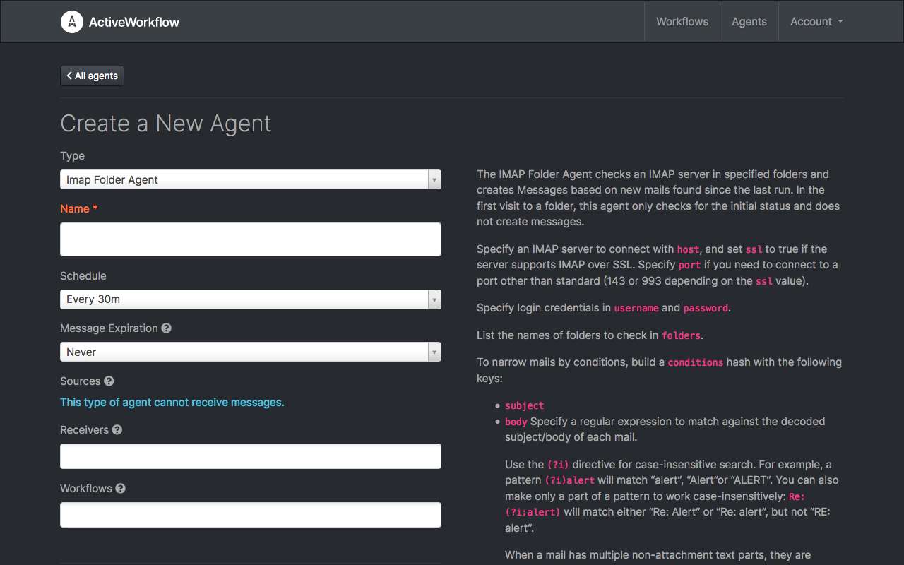
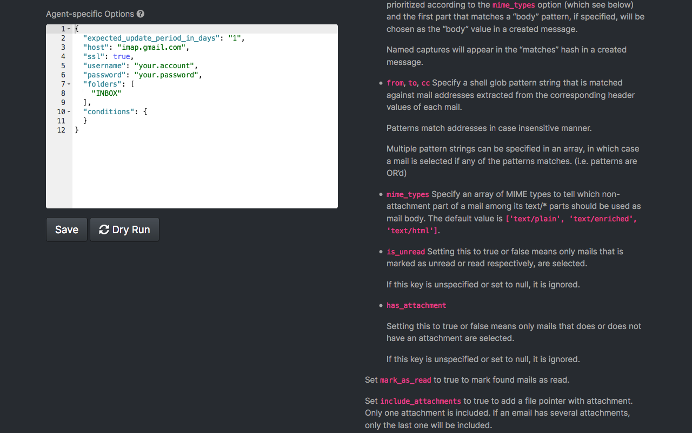
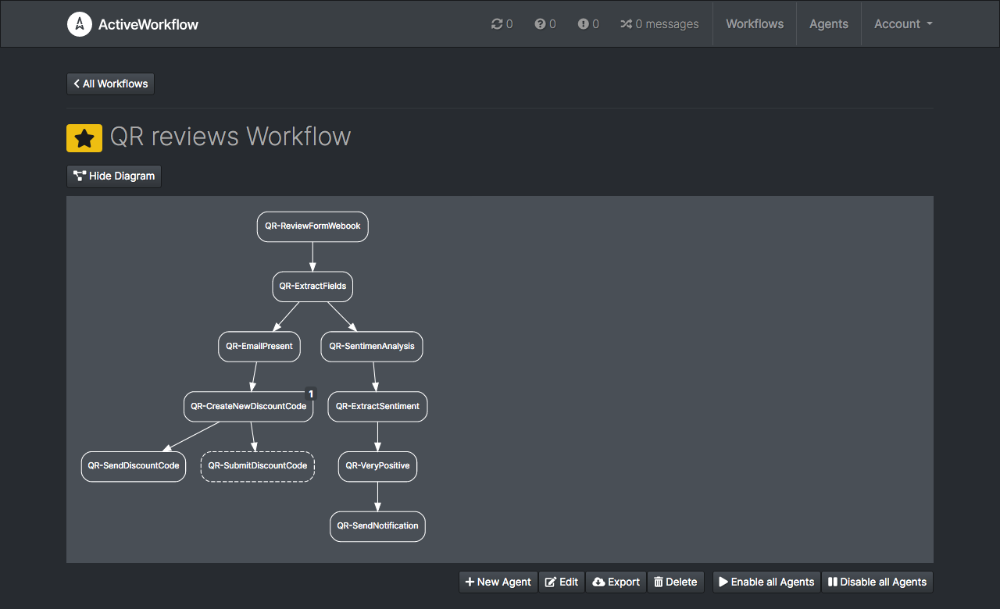

ActiveWorkflow uses **agents** and **workflows** as building blocks to achieve
its functionality. A typical objective when using ActiveWorkflow is to group
and automate functionality that would require either manual execution or
ad-hoc pieces of code. Think along the lines of generating reports, checking
websites, fetching emails, querying of APIs, but also orchestrating data pipelines
or other similar lower-level workflows. For more information about typical uses, please check
[Uses Cases](use-cases). For a description
of what exactly agents and workflows please read below.

## Agents

Agents are pieces of code that typically know how to perform a simple task.
For example, the HTTP Status Agent checks the status returned from an
HTTP request and emits a corresponding *message*, while the Twilio Agent
sends SMS messages or initiates phone calls.

Agents emit and receive messages (some only emit, or only receive). A structure
of agents designated as message sources and message targets forms a network. This
is what allows a group of agents to coordinate themselves and transform a
collection of simple tasks into sophisticated and complex behaviour.

Some agents are self-contained, like the Trigger Agent that watches for
specific values in the messages it receives. Others depend on third
party services, like the aforementioned Twilio Agent.

Agents perform actions either on schedule or when they receive a message. There
are also agents that can be triggered by external events. Agents are generally
stateful and can have memory. For example, the IMAP Folder Agent remembers the
last email it retrieved.

Each instance of an agent is configured by giving it a name, setting its schedule,
selecting the sources of the messages it receives (other agents), and choosing
among other common options:

Settings specific to a type of agent are often configured by editing
the agent's "options", which are presented as a JSON document:

Each agent type has in-line documentation explaining its functionality
and all its configuration options.

## Workflows

A network of agents can quickly become crowded, making it hard for you to discern
the whole picture. This is where the other key ActiveWorkflow concept comes into
play. Agents sharing common goals can be organised into *workflows*.

Workflows allow you to view and control groups of agents all at once. They can
also be exported and imported, so you can share automation solutions as a unit.

It is important to understand that workflows are similar to labels or tags. One
or more agents can be associated with one or more workflows but are not exclusive
to the workflow(s) they are associated with. While this may seem strange at first,
it is a powerful feature, as it allows agents to participate in multiple workflows
and to act as links between them.
