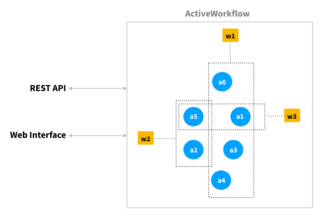

The purpose of this page is to help you try out ActiveWorkflow as easily and quickly as possible. If you find something confusing, ambiguous or have any ideas for improvement please let us know!

* [Running ActiveWorkflow](#running-activeworkflow)
  * [Running Locally with Docker](#running-locally-with-docker)
  * [Running Locally with Docker Compose](#running-locally-with-docker-compose)
  * [Running Locally without Docker](#running-locally-without-docker)
  * [Running on Heroku](#running-on-heroku)
* [Using ActiveWorkflow](#using-activeworkflow)
  * [Creating Agents](#creating-agents)
  * [Creating Workflows](#creating-workflows)

## Running ActiveWorkflow

Depending on what tools you are familiar with, there are a few different ways for you to try out ActiveWorkflow:

### Running Locally With Docker

You can run ActiveWorkflow locally using Docker. To do so you need to have Docker installed. If you are on a Mac see [Install Docker Desktop on Mac](https://docs.docker.com/docker-for-mac/install/). On Linux please use your package manager, or follow this [docker installation guide](https://docs.docker.com/install/overview/). To run ActiveWorkflow locally with Docker simply run the following:

```sh
docker run -p 3000:3000 --rm automaticmode/active_workflow
```

Once it starts you can login at `http://localhost:3000` with `admin`/`password`.

If you want data persistence, you could use the following:

```sh
docker run -p 3000:3000 --rm -v aw-data:/var/lib/postgresql/11/main automaticmode/active_workflow
```

The ActiveWorkflow image has a PostgreSQL database server included and runs all processes in one container. For production use we would still recommend using an external database and multiple containers to run web, scheduler, and worker respectively. For more information on this see [Deployment Using Docker](deployment#using-docker)

### Running Locally With Docker Compose

To install docker-compose please see [Install Docker Compose](https://docs.docker.com/compose/install/). 

To run ActiveWorkflow (with a PostgreSQL database in a separate container) issue the following command inside the project directory:

```sh
docker-compose up
```

This starts a ActiveWorkflow instance locally at `http://localhost:3000` with the login credentials `admin` / `password`.

You can stop containers by issuing:

```sh
docker-compose down
```

### Running Locally Without Docker

To run ActiveWorkflow locally without Docker you would effectively follow very similar steps to running it locally for development. Thus, please see [Development](https://github.com/automaticmode/active_workflow/wiki/Development) for more information.

### Running on Heroku

An easy way to try out or to start using ActiveWorkflow is by deploying it to [Heroku](https://www.heroku.com/). If you are reading this document in a browser you can click the button bellow, fill in the environment variables for your seed user (admin), and deploy ActiveWorkflow to your Heroku account:
* `SEED_USERNAME`
* `SEED_PASSWORD` (which must be at least 8 characters long)
* `SEED_EMAIL`

[](https://heroku.com/deploy?template=https://github.com/automaticmode/active_workflow&env[SINGLE_DYNO]=1)

Please note that while a free Heroku plan can be used to try out ActiveWorkflow, it wouldn't be sufficient for real use. The button above deploys ActiveWorkflow in a single-dyno mode that is good for demonstration or getting-started purposes (it is the only way to run ActiveWorkflow on Heroku's Free plan). For production use you should remove (or set to '0') a `SINGLE_DYNO` environment variable and in addition to the `web` dyno also start `scheduler` and `worker` dynos.

## Using ActiveWorkflow

Once you have ActiveWorkflow up and running you will want to create some agents and most probably to arrange them in one or more workflows. You can use ActiveWorkflow via its web interface and its REST API. This is illustrated in the example diagram below where a1-a6 are six agents and w1-w3 are three workflows these agents participate in.



You can read more about the [Typical Use Cases](use-cases) of ActiveWorkflow.

### Creating Agents

There are currently three ways to create agents:

1. You can create a new instance of a built-in agent by following the agent's configuration options and inline documentation. With [30+ built-in agents](built-in-agents) you have the ability to address some common use cases, such as polling external services.
2. If the functionality you are looking for isn't available from any of the built-in agents, you may use the built-in JavaScript agent, which executes JavaScript code that can send and receive messages while implementing your own business logic.
3. Last but not least, to make the most out of the platform you are expected to write and connect your own ActiveWorkflow agents. See [How to Create Your Own Custom Agents (with the Remote Agent API)](remote-agent-api) to learn how to do this.

### Creating Workflows

To create a workflow you simply use the web interface (the "New Workflow" button) to enter a name, description, select an icon for your workflow, and then link to it the agents that participate in it. As we mention in [ActiveWorkflow Basics](activeworkflow-basics) agents can participate in multiple workflows, and exist independently of them. In that respect a workflow is more like a "tag" or a "label" rather than a "container".

In the near future you'll also be able to programmatically create workflows (via the [Client REST API](rest-api)).
