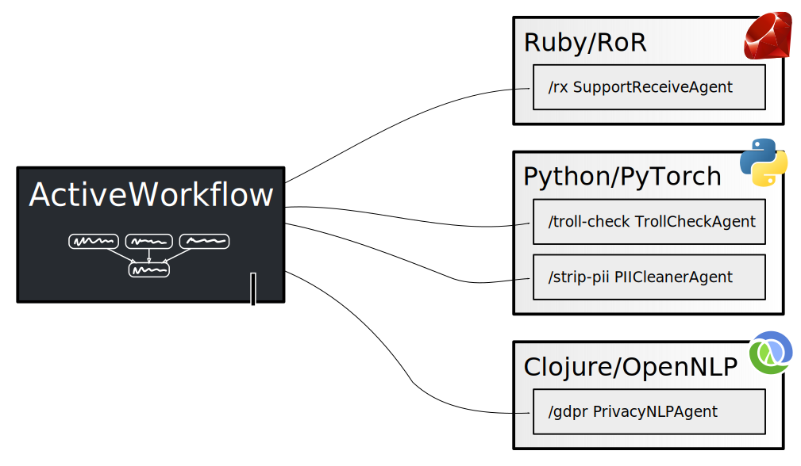

> The way to develop your own Activeworkflow agents.

## Overview

You can develop your own agents using ActiveWorkflow's Remote Agent API.
&ldquo;Remote&rdquo; in this context means that **agents run in separate processes**
from ActiveWorkflow itself. Communication between agents and ActiveWorkflow
takes place via HTTP. Each agent is effectively an HTTP server which
ActiveWorkflow interacts with via the protocol described below.



## Protocol

ActiveWorkflow talks to an agent over HTTP and all the contents are in JSON
(both requests and responses). Although all communication happens using a
single endpoint, **an agent has to implement and handle 3 &ldquo;methods&rdquo;:
[register](#the-register-method), [receive](#the-receive-method),
and [check](#the-check-method).**

### Requests

All requests coming from ActiveWorkflow's agent API have the following structure:

```js
{
  "method": method,
  "params": params
}
```

Where `method` is the name of the method, and `params` is a JSON object
(key/value pairs) that holds all the parameters to the method call. The
content of `params` varies depending on the method called. For more details
on the structure of `params` please see the documentation about each
method below.

> ⚠️ Additional fields may be present in the request's JSON object, please
> only use the ones described in this document. Any additional fields are not
> guaranteed to exist or to have any fixed meaning.

### Responses

A response from the agent to ActiveWorkflow's agent API should always have the
following structure:

```js
{
  "result": result
}
```

Where `result` is a JSON object (key/value pairs). For more details on the
structure of `result` please see the documentation about each method below.


### Methods

An agent has to **implement responses to 3 methods: [register](#the-register-method),
[check](#the-check-method), [receive](#the-receive-method)**. 

#### The `register` Method

This method is used by ActiveWorkflow to retrieve an agent's metadata. It is
sent when ActiveWorkflow starts. It does not have any parameters.

##### Register Request

A [register](#the-register-method) request looks like this:

```json
{
  "method": "register",
  "params": {}
}
```

##### Register Response

 An agent has to respond with the metadata describing it. An example response
 to [register](#the-register-method) looks like the following:

```json
{
  "result": {
    "name": "MyAgent",
    "display_name": "My Agent",
    "description": "This is my first agent",
    "default_options": {"option": "value"}
  }
}
```

Where:

- `name`: the name of an agent to be used in the agent type registry. It must be a
  unique identifier written in CamelCase;
- `display_name`: the name of an agent to be used for UI purposes;
- `description`: the description of an agent
   (in [markdown](https://en.wikipedia.org/wiki/Markdown)). It should include
   an introduction (the first line) and usage information, including a
   description of all configuration options;
- `default_options`: the default options that a user can use as a starting
   point when configuring an agent; this is an object (key/value collection).

#### The `receive` Method

This is the method that ActiveWorkflow calls when an agent has to process a
message. The contents of the message are in the `payload` field. Additionally
ActiveWorkflow submits all the configuration, memory (state), and user
credentials that an agent may need.

> ⚠️ Agents in ActiveWorkflow are **state-full entities**, but your agent
> implementation (the `receive` and `check` methods) **should be completely state-less**.
> All the necessary &ldquo;state&rdquo; is passed in the parameters. Your agent
> implementation should not store any data, except in third party systems if that
> is the intended behaviour of the agent (i.e. an ElasticSearch agent may store
> messages in an ElasticSearch instance, but even then the URL to that instance
> should come from the parameters the agent receives). If you do any caching,
> please do so very carefully.

##### Receive Request

An example [receive](#the-receive-method) request looks like the following:

```json
{
  "method": "receive",
  "params": {
    "message": {
      "payload": {"a": 1, "b": 2}
    },
    "options": {
      "option": "value",
      "email_credential": "admin_email"
    },
    "memory": {
      "key": "value"
    },
    "credentials": [
      {"name": "admin_email", "value": "admin@example.com"}
    ]
  }
}
```

Where:

- `message`: the message object that an agent has to process, it must include a `payload` object;

- `options`: the configuration options for an agent, this is an object;

- `memory`: the memory (state) of an agent, can be updated by an agent;

- `credentials`: an array of user credentials; these are key/value pairs of
  strings that the user sets to be used by an agent. Presence of any hard-coded
  credentials should not be expected. Credential data should be only used if
  explicitly configured by the user, like in the example above
  where the `email_credential` option explicitly refers to the `admin_email` credential.

##### Receive Response

 An agent should respond with any new messages, log entries, error log entries
 and updated memory. An example response to [receive](#the-receive-method)
 looks like the following:

```json
{
  "result": {
    "errors": [
      "Something failed",
      "Something else failed"
    ],
    "logs": [
      "Something happened",
      "Something else happened"
    ],
    "memory": {
      "key": "new value"
    },
    "messages": [
      {
        "a": 5
      },
      {
        "a": 6
      }
    ]
  }
}
```

Where:

- `errors`: optional, an array of non-empty error strings if errors occurred during execution;

- `logs`: optional, an array of non-empty strings to log, for debugging/info purposes;

- `memory`: optional, new content of the memory for an agent, old memory
  content will be **replaced** with the new content;

- `messages`: optional, an array of message payloads; each payload must be an
  object. In the example above there are two messages emitted.


#### The `check` Method

The `check` method is very much like the `receive` method, but it is called on schedule
(set by the user) and **has no message to process**. Everything else is exactly
like in the [receive](#the-receive-method) method. It can be used when you want
your agent to periodically perform some task. For example, to check an email
Inbox and emit the number of unread messages.

> ⚠️ Agents in ActiveWorkflow are **state-full entities**, but your agent
> implementation (the `receive` and `check` methods) **should be completely state-less**.
> All the necessary &ldquo;state&rdquo; is passed in the parameters. Your agent
> implementation should not store any data, except in third party systems if that
> is the intended behaviour of the agent (i.e. an ElasticSearch agent may store
> messages in an ElasticSearch instance, but even then the URL to that instance
> should come from the parameters the agent receives). If you do any caching,
> please do so very carefully.

##### Check Request

An example [check](#the-check-method) request looks like the following:

```json
{
  "method": "check",
  "params": {
    "message": null,
    "options": {
      "option": "value"
    },
    "memory": {
      "key": "value"
    },
    "credentials": [
      {"name": "admin_email", "value": "admin@example.com"}
    ]
  }
}
```

##### Check Response

An example response to [check](#the-check-method) looks like the following:

```json
{
  "result": {
    "errors": [
      "Something failed",
      "Something else failed"
    ],
    "logs": [
      "Something happened",
      "Something else happened"
    ],
    "memory": {
      "key": "new value"
    },
    "messages": [
      {
        "a": 5
      },
      {
        "a": 6
      }
    ]
  }
}
```

Where:

- `errors`: optional, an array of non-empty error strings if errors occurred during execution;

- `logs`: optional, an array of non-empty strings to log, for debugging/info purposes;

- `memory`: optional, new content of the memory for an agent, old memory
  content will be **replaced** with the new content;

- `messages`: optional, an array of message payloads; each payload must be an
  object. In the example above there are two messages emitted.

## Deployment

The flexibility to implement remote agents using any technology stack also has a cost,
which is having to deploy and run the agents. Each agent has to expose a single endpoint.
ActiveWorkflow **will not restart or interfere with your agents' process (or container)**
in any way. We suggest using a supervisor (e.g., systemd) of your choice, or functionality
provided by docker and its orchestration solutions. In the near future we intend to provide some
guidelines and examples for the most common deployment scenarios; please stay tuned.

To inform ActiveWorkflow about an agent you have to set an environment variable pointing to the URL of the agent:

```sh
REMOTE_AGENT_URL=https://localhost:5000/agent_path
```

You can configure multiple agents by setting multiple environment variables with postfixed incremental numbering:

```sh
REMOTE_AGENT_URL_2=https://otherhost:80/another_agent
```

In development if you are using [docker to run ActiveWorkflow](/#running-locally-with-docker),
you will need to use the `-e` parameter to `docker run` to pass `REMOTE_AGENT_URL` through
to ActiveWorkflow. The address in the URL will also have to be updated to match where the agent
is running (`127.0.0.1` is unlikely to be correct). Docker provides `host.docker.internal` for the host IP.
Thus, you could run:
```sh
docker run -e REMOTE_AGENT_URL="http://host.docker.internal:5000/" -p 3000:3000 --rm automaticmode/active_workflow
```

> ⚠️ Currently there is no authorisation support when connecting to remote agents, please ensure URLs are not publicly accessible.

## Example Agents

Please see the [Examples of Custom Agents](agent-examples) page, which you will hopefully find useful as a reference or as a starting point for making your own agents.
